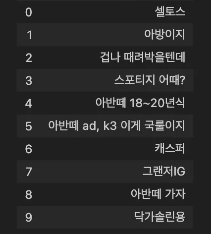
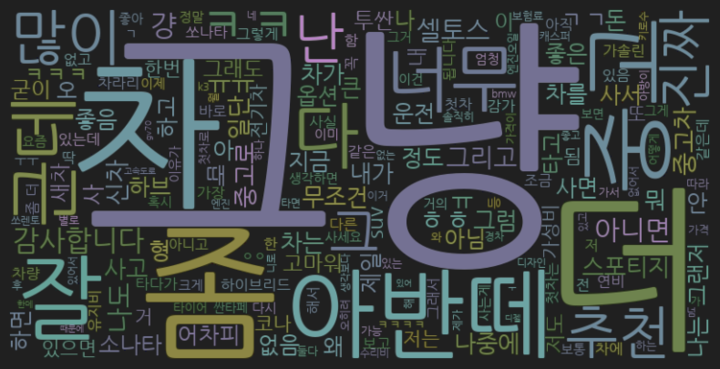

# 5조 W2M5 팀 활동 정리

# 아이디어

- 기존의 트위터 데이터를 이용한다면
    - 트윗의 날짜를 이용하여 선거철에 대선후보들을 어떻게 평가하는지 ?
    - 아침 점심 저녁 시간대별로 키워드들이 어떻게 나타나는지 ?
    - 신상품 출시에 대해서 어떻게 반응이 나타나는지?
        - 긍정/부정적인 키워드에 어떤 단어들이 들어가있느냐에 따라 추가적인 경제적 가치 제공 (뚜껑이 부정적이다 → 뚜껑 개선)
- 트위터 데이터는 일상적인 데이터라고 판단 → 좁은 카테고리를 선정해보자 → 자동차 데이터 이용
- 자동차와 관련된 데이터를 이용한다면
    - 중고차 관련 추천 데이터
        - 중고차 앱, 중고차 동호회 카페에서 데이터 수집
    - 첫차 관련 추천 데이터
        - 첫차 구매 → 블라인드 커뮤니티에서 첫차 추천 게시글의 댓글 데이터 이용

# 최종 선정 주제 및 고객

- 주제 : 사회초년생들이 첫차를 구매할 때 많이 추천받는 모델 또는 고려하는 요소
- 고객 : 사회초년생을 타겟으로 한 신차 출시 관련 팀, 현대 인증중고차 관련 팀

# 주제 선정 이유

- 사회초년생은 수입이 생긴지 얼마 안됐기 때문에 큰 지출이 발생하는 것에 민감하다. 그리고 첫 차를 구매하는 과정에서는 사람들에게 추천을 많이 받는 반면 이후 차량 구매에 있어서는 본인만의 기준으로 구매하기 떄문에 사회초년생의 첫 차 추천 데이터를 수집하면 비즈니스 가치 제공 가능하다.
- 블라인드 커뮤니티를 선택한 이유는 기존 유저들이 자신의 기업 이름을 걸고 답변해주는 곳이면서, 사회생활 경험이 많은 선배들에게 조언을 받으려 하는 사회초년생이 많을 것이라 생각했다.
- 블라인드는 직장내 이메일을 등록하여야 회원가입이 되기 때문에, 블라인드를 통한다면 회사원들의 의견을 잘 구할수 있다

# 데이터 수집 과정

- 첫차 구매는 주로 사회 초년생에게서 일어나기 때문에 블라인드 ‘자동차’ 카테고리에서 ‘첫차’라는 단어가 포함되어 있는 최신 게시글의 댓글을 크롤링 하였다. 게시글은 일반적으로 ‘첫차 추천해줘’라는 글로, 이와 관련된 추천 정보 단어들은 댓글에 있기 때문에 본문은 제외하고 댓글만 크롤링하였다.
- 첫차 검색 이후 pseudo 코드 (프로토타이핑 과정 중 생긴 문제점은 빨간색)
    
    사용 기술 스택: Selenium
    
    1. [https://www.teamblind.com/kr/search/첫차](https://www.teamblind.com/kr/search/%EC%B2%AB%EC%B0%A8) 이 URL로 접속
    2. 카테고리를 전체→자동차로 설정
        1. <span style="color:red">창의 크기에 따라 작으면 모바일로 인식되어 html 태그 값이 달라짐 → 항상 max-size로 창크기 설정하여 일관성 유지</span>
    3. 글을 추천순→최신순으로 설정
    4. 날짜 기준으로 앞에서부터 스크래핑하여 1000개의 단어를 가져올 때까지 아래 내용 반복
        1. 글마다 있는 \<a>태그, class=pre-text의 href 링크를 통해 새 탭에서 열기
            1. <span style="color:red">글을 클릭하고 정보를 수집한 이후 뒤로가기를 한다면, 앞서 설정한 카테고리가 default 값인 전체로 초기화 되어서 새 탭에서 열어야 한다.</span>
            2. <span style="color:red">새 탭 처리 이후 메인 브라우저로 돌아왔을 때 구글 광고가 뜨는 현상 → 해결중.. 최초 한 번만 뜨니까 손으로 닫아줌</span>
        2. 게시글의 작성 날짜 string을 가져온다.
        3. \<p>태그, class=cmt-txt의 text 내용을 공백을 기준으로 단어 단위로 파싱하여 저장한다.
            1. <span style="color:red"> 동적 스크립트여서 메인 브라우저에서 아래로 스크롤을 해야 추가적으로 글을 가져올 수 있어서, 현재까지 로드된 모든 글을 처리한 후에 스크롤하여 새 글을 가져온다. </span>
            2. <span style="color:red">스크롤 내린 후 추가된 게시글을 처리하기위해 처리한 게시글 횟수 count하여 마지막 글 다음부터 처리 </span>
    5. 스크래핑한 단어들을 기준으로 word cloud 생성
        1. 수집한 단어가 댓글에 있기에 의미가 없는 단어가 많아 불용어로 처리함.
        2. 댓글 1000개에서 게시글 1000개 내에 있는 댓글 전부로 수집 범위를 늘려서 시행.  
    
    수정할 수 있는 사항 : 댓글 1000개 → 게시글 1000개 내 댓글 전부
    

# 데이터 수집 결과

- 1000개의 게시글(약 1년간의 게시물)에서 12824개의 댓글을 수집하였다
    
    
    

# 워드클라우드 결과물

- Stopword가 없을 때
    
    
    
- Stopword를 지정했을 때
    
    ```python
    my_stopwords = set(['그냥', '진짜', '더', '감사합니다', '차', '근데', '어차피', '그리고', '너무', '아님', '그래서', '무조건', '아니면', '좀', '다', 'ㅋㅋ', 'ㅋㅋㅋ', 'ㅠ', 'ㅠㅠ', 'ㅎㅎ', 'ㄱㄱ', '잘', '그', '걍', '난', '나도', '일단', '아', '오', 'ㅋㅋㅋㅋ', 'ㅇㅇ', 'ㄱ', '이', '안', '내', '내가', '형', '네', '됩니다', '합니다', 'ㅜ', 'ㅜㅜ', '후', '한', '가'])
    ```
    
    
    

# 결론

- Stopword를 쓰지 않았을 때에는 커뮤니티 용어던지, 의미없는 단어가 많았다. 하지만 Stopword로 필터링한 결과 중고 또는 차종 등의 단어가 많이 보여서 더 가치있는 wordcloud를 만들었다.
- 앞서 프로토타이핑 과정에서 생각한 비즈니스적 가치를 만들어 낼 수 있을 것으로 보인다.
    - 현대자동차 마케팅팀은 사회초년생을 대상으로 마케팅을 할 때 아반떼, 셀토스, 스포티지를 중점으로 하면 매출 향상을 기대할 수 있다.
    - 또한, 첫차 추천으로 중고차도 많이 있기 때문에 현대인증중고차 플랫폼에서 첫차 구매자를 겨냥하는 시장을 키워볼 수 있다.
